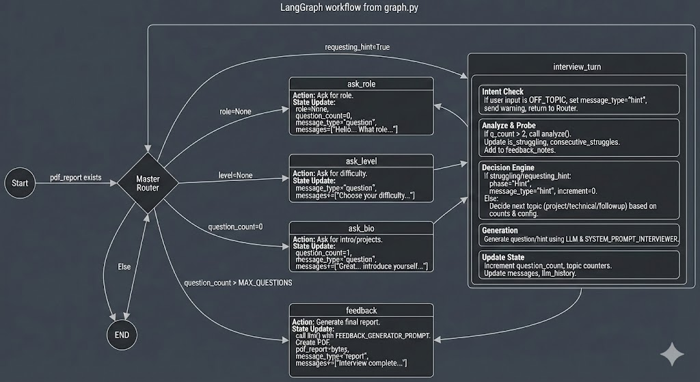

# Interview Planner

This project is an AI-powered interview simulator designed to help users practice for job interviews. It provides a realistic interview experience with different rounds and provides feedback on user performance.

## Features

-   **Realistic Interview Simulation:** Engages users in a conversational interview experience.
-   **Multiple Interview Rounds:** Supports various interview stages, including:
    -   Warm-up
    
    -   Behavioral questions
    -   Technical assessment
    -   HR round
-   **Resume-Based Questions:** Users can upload their resume (PDF), and the AI will ask relevant questions based on their experience and skills.
-   **Performance Feedback:** Provides constructive feedback to help users improve their interviewing skills.
-   **Configurable:** The interview process and prompts can be configured.

## Architecture

The application uses a graph-based approach to manage the flow of the interview. Each node in the graph represents a state in the interview process.



## Getting Started

### Prerequisites

-   Python 3.8+
-   An API key for the language model being used.

### Installation

1.  Clone the repository:
    ```bash
    git clone <repository-url>
    cd <repository-name>
    ```
2.  Install the dependencies:
    ```bash
    pip install -r requirements.txt
    ```

### Usage

1.  Set up your API keys in `config.py`.
2.  Run the application:
    ```bash
    chainlit run app.py -w
    ```
